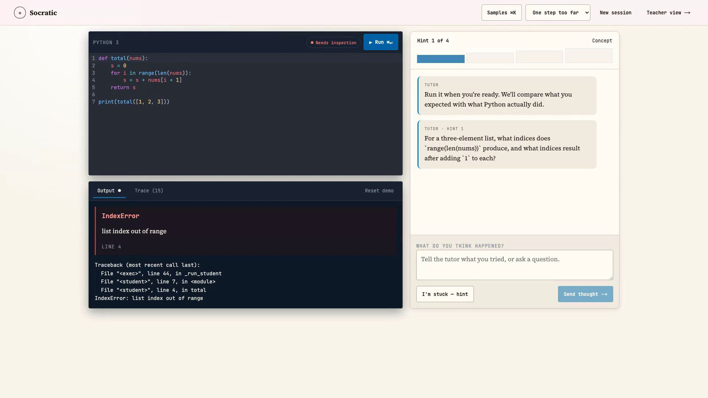
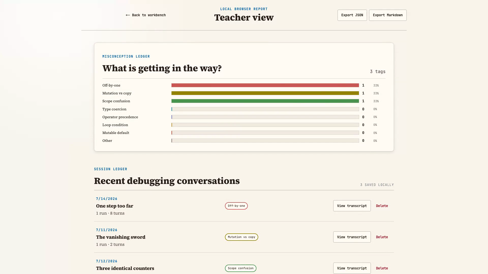
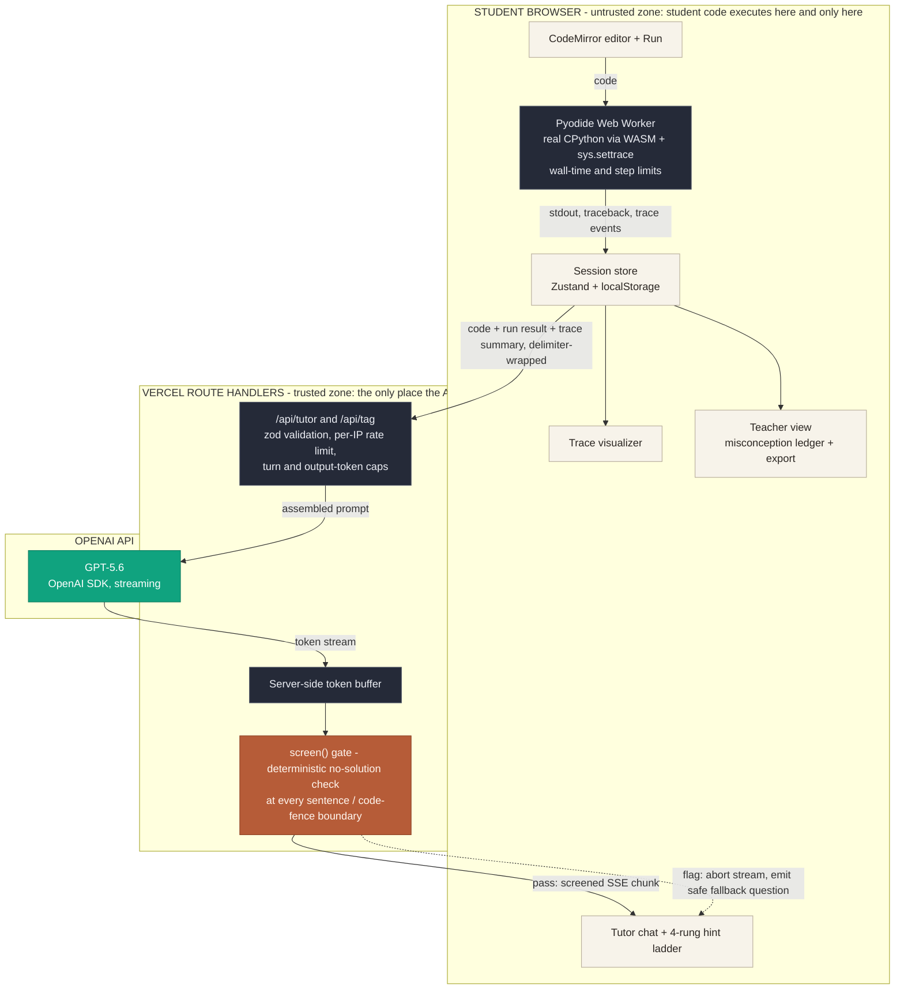

# Socratic Code Tutor

**Debug it yourself. We'll only ask questions.**

An education-track hackathon app that runs a student's actual Python in the browser, then
uses GPT-5.6 — guarded so it can only ask Socratic questions, never hand over a fix — to help
the student find their own bug. No login, no database, no server-side code execution.

[](https://github.com/SebAustin/socratic-code-tutor/actions/workflows/ci.yml)
[](#license)
[](https://socratic-code-tutor.vercel.app)
[](#codex-collaboration-narrative)

**[Live demo](https://socratic-code-tutor.vercel.app)** · **Demo video (YouTube — coming with submission)** · Submitted to OpenAI Build Week, Education track


*The workbench: real Pyodide traceback on the left, hint ladder and tutor chat on the right.*

## Try it in 60 seconds

1. Open the [live demo](https://socratic-code-tutor.vercel.app) and choose **Try a broken sample →**.
2. Press **Run**. The pinned Pyodide runtime starts lazily in a Web Worker.
3. Read the structured error and open **Trace** to inspect the real variable state.
4. Answer the tutor or choose **I'm stuck — hint** to climb one rung of the ladder.
5. Open **Teacher view** to see the misconception tag and export the report.

## Why this is different

Most coding assistants optimize for completion. This app is designed around productive struggle:

- GPT-5.6 receives the actual run result and trace, but is instructed to ask rather than fix.
- A second deterministic screen checks every complete sentence or code-fence boundary before it can reach the browser.
- The hint ladder makes escalation visible and stops at non-runnable scaffolding.
- Teachers see recurring mental-model gaps, not just pass/fail outcomes.

## Features

- **Real Python execution, client-side.** Pyodide runs student code in a Web Worker with `sys.settrace`, so the trace panel shows real variable state, not a simulation.
- **Four-rung hint ladder.** Escalates from a nudge to non-runnable scaffolding — it never reaches a complete fix.
- **Dual no-solution guardrail.** A prompt-level instruction plus a deterministic server-side screen, checked at every sentence/code-fence boundary before anything streams to the client.
- **Trace visualizer.** Step through the actual execution the student's code produced.
- **Teacher view.** Aggregates misconception tags (off-by-one, mutation vs. copy, closures, etc.) from local sessions into a grade-book-style report — no backend, no login.
- **Six bundled buggy samples** covering common intro-CS misconceptions, so judges and students always have something to click into immediately.


*Teacher view reads the same local sessions the student created — one browser, no server-side aggregation.*

## How it works



**Invariant:** no unscreened model text ever reaches the client — the orange `screen()` gate is
the only path from GPT-5.6 to the student, and a flag halts the stream mid-turn.

Student code and its trace cross the network only as quoted, delimiter-wrapped LLM context —
never as something the server executes. Model tokens are buffered server-side and only
screened, complete chunks are flushed over SSE; a flagged chunk is replaced with a safe
Socratic question. See `PLAN.md` for the full trust-zone breakdown and `SECURITY.md` for the
audit.

## Getting started

Requires Node 24 and pnpm.

```bash
pnpm install
cp .env.local.example .env.local
pnpm dev
```

Set a server-side API key in `.env.local`:

```dotenv
OPENAI_API_KEY=sk-your-key-here
OPENAI_MODEL=gpt-5.6
```

`OPENAI_MODEL` is optional. The server defaults to `process.env.OPENAI_MODEL ?? 'gpt-5.6'`.

### Useful commands

```bash
pnpm lint
pnpm typecheck
pnpm test
pnpm test:coverage
pnpm build
pnpm e2e --project=chromium
pnpm e2e:cross-browser
```

The `@live` Playwright smoke is excluded from the default suite so CI never spends API credits.
Run it manually against the final deployment before submission.

### Bundled debugging samples

| Sample | Misconception |
| --- | --- |
| One step too far | off-by-one |
| The vanishing sword | mutation vs copy |
| Three identical counters | closure/scope confusion |
| A search with no answer | loop condition |
| Alice meets Bob's grades | mutable default argument |
| Numbers wearing quotes | type coercion |

All samples are deterministic and live in `src/features/demo/samples.ts`.

## Testing & verification snapshot

| Check | Result |
| --- | --- |
| Vitest unit/integration tests | 84 tests across 16 files |
| Deterministic Chromium checks | 7 pass, including real Pyodide trace fidelity |
| Real-runtime Chromium smoke | Confirms Pyodide 314.0.2 returns `IndexError` on line 4 plus a non-empty trace |
| Measured real-runtime smoke | 2,395 ms from Run click to visible structured result; 4 ms inside Python for execution plus trace capture |
| Line coverage (priority logic surface) | 93.25% |
| Adversarial solution-shaped outputs | 10 tried; 0 runnable fixes reach the client fixture |
| Guardrail performance bound | Under 5 ms for a 700-token-style response |
| Local checks | ESLint, TypeScript, unit coverage, and the Next.js production build pass locally |
| Node version | Node 24 is pinned for Vercel; the local build may print an engine warning under another Node version |

## Security & guardrail design

- Student Python is executed only in a browser Web Worker using Pyodide. No route handler contains `eval`, `exec`, a subprocess, or any other code-execution path.
- `OPENAI_API_KEY` is read only inside `src/app/api/tutor/route.ts` and `src/app/api/tag/route.ts`. It is never exposed through a `NEXT_PUBLIC_*` variable or client component.
- Code, output, trace, and chat are delimiter-wrapped as untrusted evidence. The system role explicitly ignores instructions embedded inside them.
- Model tokens are buffered on the server. Only complete chunks that pass `screenForClient()` are sent over SSE. A flagged chunk is replaced with a safe Socratic question.
- Runaway programs are terminated by destroying the Worker at the five-second wall limit; a trace-step ceiling also stops high-step programs.
- Public API spend is bounded by a per-instance request limit, session turn cap, and server-owned output-token cap.

Full threat model and STRIDE pass: [`SECURITY.md`](SECURITY.md).

## Codex collaboration narrative

The product contract, UX specification, and trust-zone plan were prepared before implementation.
Codex then built the core application in one primary workspace session: the typed seams,
client-only Pyodide runner, real `sys.settrace` capture, buffered server guardrail, GPT-5.6
routes, state persistence, teacher export, Marginalia interface, and acceptance suite. Codex also
verified current package/model/runtime identifiers, caught peer-version conflicts, and hardened
failure paths for quota exhaustion and CDN/runtime load failure.

The majority of core functionality was built in a single primary Codex session:

> Codex feedback session ID: **`019f6114-370f-7750-854f-c0b7a5cf32a9`**

## Deploying to Vercel

1. Import the repository into Vercel.
2. Keep the framework preset as Next.js and Node runtime at 24.
3. Add `OPENAI_API_KEY` to Production and Preview server environment variables.
4. Optionally add `OPENAI_MODEL`; otherwise the app uses `gpt-5.6`.
5. Deploy, then run the live tutor smoke and the three-browser judge-flow smoke.

The CSP in `next.config.ts` deliberately allows only the pinned jsDelivr Pyodide origin plus the
narrow WebAssembly/Worker capabilities Pyodide needs.

## Known v0 limits

- Rate limiting is in memory and therefore best-effort across Vercel cold starts/instances.
- Teacher aggregation is intentionally local to one browser.
- JavaScript execution is a stretch goal; Python is the first-class path.
- The post-generation screen is deterministic. It is defense in depth, not a formal proof that every possible natural-language hint is non-spoilery.

## Project docs

| Doc | Contents |
| --- | --- |
| [`PLAN.md`](PLAN.md) | Architecture, trust zones, tech-choice trade-offs, work packages |
| [`UX-SPEC.md`](UX-SPEC.md) | Design tokens and the "Marginalia" style direction |
| [`REQUIREMENTS.md`](REQUIREMENTS.md) | Product contract: problem statement, target users, scope |
| [`SECURITY.md`](SECURITY.md) | STRIDE audit, trust boundaries, findings and remediations |
| [`ACCEPTANCE.md`](ACCEPTANCE.md) | Verification chain and live production checks |
| [`RETROSPECTIVE.md`](RETROSPECTIVE.md) | Blameless retrospective and process-improvement proposals |

## License

MIT
