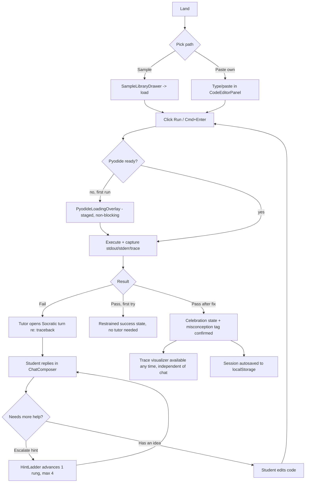
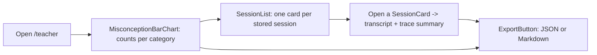

# UX Spec — Socratic Code Tutor

Companion to `REQUIREMENTS.md` / `ASSUMPTIONS.md`. Written for an AI coding agent (Codex) to implement directly. Primary viewport: 1024px+ (NFR-10); 375/768 are best-effort.

---

## 0. Style Direction — "Marginalia"

**Warm academic paper shell wrapped around a terminal core.** The app reads like an annotated notebook page — cream paper, serif editorial voice, hand-graded-feeling accent marks — with the code editor and trace as a dark, precise terminal *inset into* that page, not the whole UI. The hint ladder is drawn like a staircase of marginal annotations a TA would pencil in; the misconception report is a grade-book, not a generic BI chart.

*Why*: this is a tutoring product, not an IDE clone — paper conveys "a teacher is reading your work," terminal-dark conveys "real code, really running." The contrast between the two *is* the product's thesis (guardrailed guidance around real execution), so it should be visible, not skinned away.

Signature move: the same 4-step "staircase" visual language is reused for (1) the hint ladder, (2) the Pyodide loading rail, and (3) the trace scrubber ticks — one motif, three jobs, so the UI feels authored rather than templated.

---

## 1. Design Tokens

```css
:root {
  /* --- Color: paper shell --- */
  --color-paper:          oklch(97% 0.014 85);   /* app background */
  --color-paper-raised:   oklch(99% 0.010 88);   /* cards/panels on paper */
  --color-paper-sunken:   oklch(94% 0.016 82);   /* wells, input recesses */
  --color-rule:           oklch(85% 0.018 75);   /* hairlines, dividers */
  --color-rule-strong:    oklch(72% 0.02 70);

  --color-ink:            oklch(24% 0.02 55);    /* primary text on paper */
  --color-ink-muted:      oklch(46% 0.02 55);    /* secondary text on paper */
  --color-ink-faint:      oklch(62% 0.015 55);   /* placeholders, timestamps */

  /* --- Color: terminal core (code/trace panels) --- */
  --color-terminal-bg:      oklch(21% 0.032 255);
  --color-terminal-bg-alt:  oklch(25% 0.03 255);  /* gutter, line highlight base */
  --color-terminal-ink:     oklch(93% 0.012 90);
  --color-terminal-ink-dim: oklch(64% 0.02 250);
  --color-terminal-rule:    oklch(35% 0.03 255);
  --color-terminal-line-hi: oklch(38% 0.09 240 / 0.55); /* current-line highlight */

  /* --- Color: brand / actions --- */
  --color-accent:        oklch(58% 0.14 240);   /* chalk blue — primary actions */
  --color-accent-hover:  oklch(52% 0.15 240);
  --color-accent-active: oklch(47% 0.15 240);
  --color-accent-on:     oklch(99% 0.01 240);   /* text on accent fill */

  /* --- Color: semantic status --- */
  --color-success:       oklch(60% 0.14 150);
  --color-success-text:  oklch(38% 0.12 150);
  --color-warning:       oklch(74% 0.15 75);
  --color-warning-text:  oklch(42% 0.11 70);
  --color-error:         oklch(56% 0.19 25);
  --color-error-text:    oklch(42% 0.17 25);

  /* --- Color: hint-ladder rungs (escalating warmth = escalating strength) --- */
  --rung-1: oklch(60% 0.10 240); --rung-1-text: oklch(40% 0.11 240); /* question */
  --rung-2: oklch(62% 0.12 200); --rung-2-text: oklch(40% 0.11 200); /* localize */
  --rung-3: oklch(70% 0.14 80);  --rung-3-text: oklch(42% 0.11 75);  /* mechanism */
  --rung-4: oklch(58% 0.18 30);  --rung-4-text: oklch(40% 0.16 25);  /* near-solution ceiling */

  /* --- Color: misconception taxonomy (categorical, dataviz) --- */
  --tag-off-by-one:      oklch(60% 0.15 25);
  --tag-mutation-copy:   oklch(60% 0.13 100);
  --tag-scope:           oklch(60% 0.13 145);
  --tag-type-coercion:   oklch(60% 0.12 210);
  --tag-operator-prec:   oklch(60% 0.13 275);
  --tag-other:           oklch(58% 0.02 60);

  /* --- Typography (2 families) --- */
  --font-display: "Source Serif 4", ui-serif, Georgia, serif;   /* editorial voice: headings, tutor chat */
  --font-mono:    "JetBrains Mono", ui-monospace, "SFMono-Regular", monospace; /* code, data, labels */

  --text-xs:   clamp(0.75rem, 0.73rem + 0.1vw, 0.8125rem);
  --text-sm:   clamp(0.8125rem, 0.79rem + 0.12vw, 0.875rem);
  --text-base: clamp(0.9375rem, 0.9rem + 0.2vw, 1.0625rem);
  --text-md:   clamp(1.0625rem, 1rem + 0.3vw, 1.1875rem);
  --text-lg:   clamp(1.25rem, 1.1rem + 0.6vw, 1.5rem);
  --text-xl:   clamp(1.6rem, 1.3rem + 1.3vw, 2.25rem);
  --text-display: clamp(2.25rem, 1.7rem + 2.6vw, 3.75rem);
  --leading-prose: 1.6;
  --leading-tight: 1.25;

  /* --- Spacing (editorial rhythm, not uniform) --- */
  --space-1: 0.25rem; --space-2: 0.5rem;  --space-3: 0.75rem;
  --space-4: 1rem;    --space-5: 1.5rem;  --space-6: 2rem;
  --space-7: 3rem;    --space-8: 4.5rem;
  --space-section: clamp(2.5rem, 1.8rem + 3vw, 5rem);

  /* --- Radius: paper = soft, terminal = sharp (intentional contrast) --- */
  --radius-sm: 4px;   /* chips, badges, terminal panel */
  --radius-md: 10px;  /* cards */
  --radius-lg: 18px;  /* modals, hero panels */
  --radius-pill: 999px; /* status pills, rung dots */

  /* --- Elevation (warm-tinted shadows, not pure black) --- */
  --shadow-sm: 0 1px 2px oklch(30% 0.02 60 / 0.08);
  --shadow-md: 0 4px 14px oklch(30% 0.02 60 / 0.10), 0 1px 3px oklch(30% 0.02 60 / 0.08);
  --shadow-lg: 0 16px 36px oklch(30% 0.02 60 / 0.16);
  --shadow-terminal: inset 0 1px 0 oklch(100% 0 0 / 0.04), 0 10px 28px oklch(20% 0.03 255 / 0.4);

  /* --- Motion --- */
  --duration-instant: 100ms; --duration-fast: 150ms;
  --duration-normal: 240ms;  --duration-slow: 400ms;
  --ease-out-expo: cubic-bezier(0.16, 1, 0.3, 1);
  --ease-standard: cubic-bezier(0.4, 0, 0.2, 1);
}
```

Google Fonts: `Source Serif 4` (400/600/700, italic for tutor emphasis) and `JetBrains Mono` (400/500/700). `font-display: swap` on both; preload the two weights actually used above the fold (Source Serif 4 600, JetBrains Mono 400).

---

## 2. Information Architecture & Flows

Routes: `/` (workbench, single-page app — sample/session state in query param `?session=`), `/teacher` (report view). No auth.

### 2a. Judge / demo entry (must be ≤1 click, <3 min full loop — SC-3)

```mermaid
flowchart LR
  A[Land on /] --> B{First visit?}
  B -->|yes| C[DemoModeBanner: "Try a broken sample" CTA]
  C --> D[1 click: preload sample #1 + inline explainer]
  D --> E[Workbench, code + explainer visible]
  B -->|no| E
  E --> F[Run]
```

### 2b. Student flow



### 2c. Teacher flow



---

## 3. Screens

### Screen 1 — Landing / Demo entry (first paint, no session yet)

```
┌──────────────────────────────────────────────────────────────────┐
│  Socratic ⌗ mark        [Sample Library ▾]   [Teacher View →]     │
├──────────────────────────────────────────────────────────────────┤
│   (paper, generous margin)                                        │
│   H1 "Debug it yourself. We'll only ask questions."               │
│   sub: 1-line what/why + "no login, runs in your browser"         │
│                                                                    │
│   ┌ DemoModeBanner (paper-raised card, left rule accent) ───────┐ │
│   │ "New here? Try a broken sample in one click."               │ │
│   │ [ Try a broken sample → ]  (primary button)                 │ │
│   └───────────────────────────────────────────────────────────── ┘ │
│                                                                    │
│   SampleLibraryGrid (6 SampleCard, editorial list not grid-of-    │
│   equal-boxes — title + 1-line bug hint + misconception chip)     │
└──────────────────────────────────────────────────────────────────┘
```
Components: `TopBar`, `LogoMark`, `SampleLibraryDrawer`, `DemoModeBanner`, `SampleCard`, `TeacherViewLink`.
Empty: none needed (samples always bundled). Loading: none (static, instant). Error: none.

### Screen 2 — Main Workbench (post sample/paste load) — primary screen

```
┌────────────────────────────────────────────────────────────────────────────┐
│ TopBar: Socratic ⌗  SampleLibrary▾  SessionSwitcher▾         [Teacher →]    │
├───────────────────────────────────────────────┬────────────────────────────┤
│ EditorToolbar: Python  [▶ Run  ⌘⏎]  StatusPill │ HintLadderRail (staircase, │
├───────────────────────────────────────────────┤ 4 rungs, current lit)      │
│ CodeEditorPanel (terminal-dark, mono, gutter)  ├────────────────────────────┤
│  1  def total(nums):                          │ TutorChatPanel             │
│  2      s = 0                                  │  ChatMessage(tutor)        │
│  3      for i in range(len(nums)):             │  ChatMessage(student)      │
│  4 ▍        s = s + nums[i+1]   ← line-hi      │  … (aria-live region)      │
│  5      return s                               │  StreamingCursor           │
│                                                 │                            │
├───────────────────────────────────────────────┤                            │
│ Tabs: [ Output ● ] [ Trace ]                    │                            │
│  OutputPanel: TracebackCard (type/msg/line)    │                            │
│   or TraceVisualizerPanel: TraceScrubber +      │                            │
│   VariableTable + CallStackBadge                ├────────────────────────────┤
│                                                 │ ChatComposer               │
│                                                 │ [ I'm stuck — hint ↑ ]     │
└───────────────────────────────────────────────┴────────────────────────────┘
```
Grid: 1440px container, 60/40 column split (`grid-template-columns: minmax(0,1.5fr) minmax(360px,1fr)`), 24px gutter, 32px page margin. Left column is a vertical stack (`editor 55% / output-trace 45%` of left-column height, resizable divider optional stretch goal).

Components: `EditorToolbar`, `LanguageBadge`, `RunButton`, `StatusPill` (idle/running/success/error/timeout), `CodeEditorPanel`, `LineGutter`, `CurrentLineHighlight`, `OutputTabs`, `OutputPanel`, `StdoutView`, `TracebackCard`, `TraceVisualizerPanel`, `TraceScrubber`, `VariableTable`, `CallStackBadge`, `HintLadderRail`, `HintRungStep`, `TutorChatPanel`, `ChatMessage`, `StreamingCursor`, `ChatComposer`, `EscalateHintButton`, `SessionSwitcher`, `SampleLibraryDrawer`.

States:
- **Empty** (fresh session, no run yet): OutputPanel shows `EmptyState` — "Nothing's run yet. Hit Run (⌘/Ctrl+Enter) to see what happens." TutorChatPanel shows a single tutor greeting, no ladder lit.
- **Loading (Pyodide first init)**: see §3a below — non-blocking overlay inside Output area only; editor stays usable.
- **Running**: `StatusPill` = "Running…" (pulsing dot, respects reduced-motion → static label), Run button disabled + `RunButton[loading]` spinner-in-button (CSS conic-gradient rotation, transform only).
- **Timeout**: `StatusPill` = "Timed out (5s limit)" in warning color; `TracebackCard` replaced by a specific timeout explainer card, not a raw error dump.
- **Streaming tutor reply**: `ChatMessage[streaming]` grows with a trailing `StreamingCursor` (blinking bar, opacity keyframes; reduced-motion → solid bar); `aria-live="polite"` region announces once per completed sentence chunk, not per token (see §6).
- **Guardrail near-miss** (FR-14 fallback fired): message renders as a normal tutor question — student never sees the flagged content; no visible "error" state, this is invisible by design.
- **Success (fix confirmed)**: `StatusPill` → success color + checkmark path-draw; restrained `CelebrationBanner` inline in chat ("Passing now — walk me through what you changed?"); no confetti by default.
- **Error (network/API failure)**: `ChatMessage[error]` bubble: "Couldn't reach the tutor. [Retry]" — never silently drops the student's message.

### 3a. Pyodide first-load state (design this deliberately — ~10MB)

Rendered **inside the Output tab only**, staircase motif reused from HintLadder:

```
┌ Output ───────────────────────────────────────────────┐
│  Booting a real Python interpreter in your browser…    │
│                                                          │
│  ● Fetching runtime        (done)                       │
│  ● Loading standard library (in progress, determinate   │
│                              bar tied to bytes loaded)   │
│  ○ Ready                                                 │
│                                                          │
│  "One-time cost — cached after this, instant next time." │
│  You can keep reading the code while this finishes.      │
└──────────────────────────────────────────────────────────┘
```
Editor and chat remain fully interactive during load. If load exceeds 8s, append: "Still working — large first download, hang tight." Never blocks the whole page (NFR-1).

### Screen 3 — Teacher Report View (`/teacher`)

```
┌────────────────────────────────────────────────────────────────────────────┐
│ ← Back to workbench         Teacher View                  [ Export ▾ ]     │
├────────────────────────────────────────────────────────────────────────────┤
│ MisconceptionBarChart (horizontal, one bar per taxonomy category,          │
│ --tag-* colors, count + % label at bar end, sorted descending)             │
│  Off-by-one            ███████████████ 7                                   │
│  Mutation vs copy      ████████ 4                                          │
│  Scope confusion       █████ 3                                             │
│  Type coercion         ███ 2                                               │
│  Operator precedence   █ 1                                                 │
│  Other                 · 0                                                 │
├────────────────────────────────────────────────────────────────────────────┤
│ SessionList (SessionCard: sample/title · primary tag chip · date · turns)  │
│  [ View transcript ]  [ Delete ]                                           │
└────────────────────────────────────────────────────────────────────────────┘
```
Components: `MisconceptionBarChart`, `TagChip` (uses `--tag-*` fill, dark text overlay for contrast), `SessionList`, `SessionCard`, `TranscriptModal`, `ExportButton` (menu: "Export report (JSON)" / "Export report (Markdown)" / "Export this transcript").

States: **Empty** (no sessions yet) — chart area replaced by `EmptyState`: "No sessions yet. Run a sample in the workbench to start building a report." + CTA back to workbench. **Loading**: none needed (localStorage read is synchronous/instant) — if it ever exceeds 100ms, show a skeleton bar chart (opacity fade only). **Error**: export failure → toast "Couldn't generate the file — try again." (never fails silently).

---

## 4. Component States (key interactive components)

| Component | Default | Hover | Focus | Active | Disabled | Loading | Empty | Error |
|---|---|---|---|---|---|---|---|---|
| `RunButton` | accent fill, `⌘⏎` hint label | `--color-accent-hover` + 1px lift shadow-sm | 2px accent ring, 2px offset | `--color-accent-active`, scale(0.98) | 50% opacity, no pointer, tooltip "Runtime busy" | in-button spinner, label "Running…" | — | — |
| `EscalateHintButton` | outline style, ink text, "I'm stuck — hint" | fill tint `--rung-N/10%` | 2px accent ring | scale(0.98) | disabled + "Ceiling reached" at rung 4 | brief pulse while tutor drafts next rung | — | toast on send failure |
| `HintRungStep` (×4) | dot outline, muted | n/a (not hoverable, indicator only) | n/a | — | future rungs at 40% opacity | current rung: filled + scale(1.15) pulse once | rung 0 = all outline, no chat yet | — |
| `ChatComposer` | paper-sunken textarea, placeholder present | rule-strong border | 2px accent ring on textarea | send button active state on valid input | send disabled while streaming | textarea shows "Tutor is typing…" caption | placeholder: "Tell the tutor what you tried, or ask a question." | inline red text below field on send failure |
| `TraceScrubber` | filled track to current step, tick per step | tick hover shows tooltip w/ line number | 2px ring on handle, arrow-key steppable | handle scale(1.1) while dragging | disabled + "Run to generate a trace" tooltip if no trace yet | — | "No trace yet — run your code" | "Trace unavailable for this run" if capture failed |
| `SessionCard` | paper-raised, shadow-sm | shadow-md, lift 2px | 2px ring on card | pressed: shadow-sm again | — | — | — | "Couldn't load this session" inline |
| `ExportButton` | outline button + chevron | tint fill | 2px ring | menu opens, chevron rotates 180° (transform) | disabled if 0 sessions | brief "Preparing file…" label swap | — | toast: "Export failed — try again" |

Touch targets: all interactive elements ≥44×44px hit area (padding may extend beyond visual bounds) per NFR-7 / WCAG 2.5.5.

---

## 5. Microcopy

**Tutor voice**: warm, curious, never condescending; always a question or an observation before any statement; addresses the student as capable ("you already wrote most of this correctly"); never says "wrong," says "let's check."

- Rung 1 (conceptual): "Before we look at the code — what do you expect `total([1,2,3])` to return, and why?"
- Rung 2 (localization): "Take a closer look at what happens inside the loop, specifically on the line that updates `s`."
- Rung 3 (mechanism): "Lists are indexed starting at 0, and `range(len(nums))` already covers every valid index — does your indexing expression match that?"
- Rung 4 (near-solution ceiling): "You're one index expression away. Describe in your own words what the correct index should be for each step of the loop — no need to write the fix here yet, just say it out loud."
- Escalate affordance label: **"I'm stuck — hint"** (rungs 1→3), becomes **"One more nudge"** at rung 3→4, and **"You've reached the last hint"** (disabled) at rung 4 — never "give me the answer."
- Guardrail redirect (when a student directly asks for code): "I won't hand you the fixed code, but I can help you find it — what does line 4 do differently from what you intended?"
- Success/celebration (restrained, no confetti default): "Passing now. Before we move on — what was different about the fix?" StatusPill label: "All tests passing" / "Runs clean."
- Empty states: Output — "Nothing's run yet. Press Run (⌘/Ctrl+Enter) to see what happens." Trace — "No trace yet — run your code to generate one." Teacher — "No sessions yet. Run a sample in the workbench to start building a report."
- Errors: Timeout — "This run hit the 5-second limit — check for a loop that never ends." Network — "Couldn't reach the tutor. [Retry]" Export — "Couldn't generate the file — try again."
- Button labels: `Run`, `I'm stuck — hint`, `New session`, `Delete session` (with confirm: "Delete this session? This can't be undone."), `Export report`, `View transcript`, `Try a broken sample →`.

---

## 6. Interaction & Motion

Only compositor-friendly properties animate: `transform`, `opacity`, `clip-path`. No layout-property animation.

| Moment | Property | Duration/Easing | Purpose |
|---|---|---|---|
| Panel/tab switch (Output↔Trace) | opacity 0→1 + translateY(6px→0) | `--duration-normal` / `--ease-out-expo` | Clarify which view is active |
| Chat message arrival | opacity + translateY(4px→0) | `--duration-fast` / `--ease-standard` | Reduce jarring pop-in |
| Streaming caret | opacity keyframe pulse | 900ms loop | Signal "still generating" |
| HintRungStep activation | transform scale(1→1.15→1) + fill opacity crossfade | `--duration-normal` / `--ease-standard` | Make escalation *felt*, not just labeled |
| TraceScrubber step | CurrentLineHighlight translateY to new line position | `--duration-normal` (named `--duration-trace-step`) / `--ease-standard` | Playhead feel, ties trace to editor |
| Success checkmark | `stroke-dashoffset` path draw | `--duration-slow` / `--ease-out-expo` | Restrained payoff, no confetti |
| Button press | scale(1→0.98) | `--duration-instant` | Tactile feedback |

`prefers-reduced-motion: reduce` → all durations collapse to ≤1ms except opacity-only fades (kept at `--duration-fast`, no movement/scale component); streaming caret becomes a static solid bar; success checkmark appears instantly (no path draw); confetti (opt-in setting only, default off) is fully suppressed regardless of setting.

---

## 7. Accessibility (WCAG 2.1 AA)

**Keyboard map**: `Cmd/Ctrl+Enter` = Run (global, works from editor or chat focus); `Cmd/Ctrl+K` = open Sample Library; `Cmd/Ctrl+/` = focus chat composer; `Tab`/`Shift+Tab` = standard forward/back through TopBar → EditorToolbar → CodeEditorPanel → OutputTabs → panel content → HintLadderRail (read-only, skipped in tab order, exposed via `aria-describedby` on composer instead) → ChatMessage list → ChatComposer → EscalateHintButton; `Arrow Left/Right` = step `TraceScrubber` when focused; `Esc` = close any open drawer/modal and return focus to its trigger.

**Focus order**: logical DOM order matches visual left-to-right, top-to-bottom; no positive `tabindex`; modals (`TranscriptModal`, `SampleLibraryDrawer`) trap focus and restore it to the triggering element on close.

**ARIA**:
- Landmarks: `<header>` TopBar, `<main>` workbench, two `<section aria-label="Code editor">` / `<section aria-label="Tutor conversation">`, `<aside aria-label="Execution output and trace">`.
- `TutorChatPanel` message list: `role="log" aria-live="polite" aria-relevant="additions"`; announce completed message text only (buffer streaming tokens, flush on sentence-end or turn-complete) — never per-token, to avoid announcement spam.
- `HintLadderRail`: `role="group" aria-label="Hint progress"`, each `HintRungStep` gets `aria-current="step"` on the active rung and a text alternative ("Hint 2 of 4: Localization") duplicated visually as a caption, not color-only.
- `TraceScrubber`: native `<input type="range">` or `role="slider"` with `aria-valuemin/max/now` and `aria-valuetext` = "Step 3 of 12, line 4".
- `StatusPill`: `role="status" aria-live="polite"` for run-state changes (idle/running/success/error/timeout), text label always present (never icon-only).
- `CodeEditorPanel`: uses an accessible code editor (CodeMirror 6 recommended) with proper `textbox`/`multiline` semantics, not a bare `contenteditable` div.

**Contrast commitments**: body ink (`--color-ink` L24% on `--color-paper` L97%) and terminal ink (`--color-terminal-ink` L93% on `--color-terminal-bg` L21%) both exceed 4.5:1 by a wide margin. Any hint-rung or misconception-tag color used **as text on paper** must use its paired `-text` token (L≤42%), never the raw fill token, which is reserved for backgrounds/fills paired with dark text on top. Status colors (`success`/`warning`/`error`) always pair a text label with the color — never color alone to convey meaning.

**Touch targets**: 44×44px minimum for all buttons, chips, tabs, and the trace-scrubber handle (visual size may be smaller; hit area padded).

**Motion**: see §6 reduced-motion behavior; no auto-playing looping animation exceeds 5s or lacks a pause mechanism (streaming caret pauses automatically when generation completes).

---

## 8. Responsive Behavior

| Breakpoint | Layout |
|---|---|
| **1440** (primary) | Full 2-column bento: 60/40 split, 32px page margins, editor/output stacked left, chat full-height right, HintLadderRail as a horizontal rail above chat. |
| **1024** (primary target, NFR-10) | Same 2-column structure, split narrows to 55/45; TopBar labels may abbreviate (icon+tooltip for SampleLibrary/SessionSwitcher); minimum chat column width 360px enforced before collapsing to tabs. |
| **768** (best-effort) | Collapses to a single-column top-level tab bar: `[ Code ] [ Output/Trace ] [ Tutor ]`. HintLadderRail becomes a sticky mini-bar pinned atop the Tutor tab content. RunButton and StatusPill pin to a persistent bottom action bar for thumb reach. |
| **375** (best-effort) | Same tabbed structure as 768; SampleLibrary/SessionSwitcher collapse into a single overflow menu in TopBar; CodeEditorPanel enforces a 13px minimum font floor (never below); TraceVisualizer's VariableTable switches from a table to a stacked key/value list to avoid horizontal scroll. |

No breakpoint permits horizontal page-level scroll. Below 768, `TraceScrubber` remains fully usable via arrow keys and a larger (56px) drag handle for touch precision.

---

## 9. Open Design Risks

1. **Trace-to-editor line sync at narrow widths** — on 768/375 tabbed layout, the CurrentLineHighlight playhead effect loses its side-by-side "aha" moment since editor and trace aren't simultaneously visible; mitigate with a small inline code snippet echoed inside the Trace tab itself.
2. **Streaming aria-live granularity** — sentence-boundary flushing is a heuristic (may clump on code-like text with periods in numbers); validate with a screen reader pass before demo recording.
3. **Hint ladder rung 3→4 tone** — rung 4 ("near-solution scaffold") is the hardest copy to keep from reading as a fix; needs adversarial-prompt testing per SC-4 to confirm the guardrail and the *tone* both hold.
4. **Categorical tag palette at 6 hues, L60/C~0.13** — visually distinct in isolation; recheck adjacent-bar contrast in the actual bar chart rendering (some hue pairs at equal L/C can still look close for deuteranopia) — consider adding a subtle pattern/texture fill per category as a colorblind-safe backup, not just hue.
